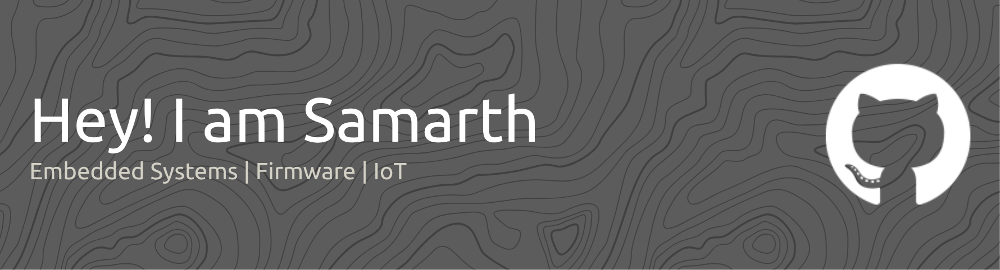

<!-- Banner -->

  

<h1 align="center">Hi, I'm Samarth Maheshwari</h1>

<h3 align="center">
Embedded Systems • Firmware • IoT
</h3>

Passionate about designing reliable embedded systems that bridge electronics and software.

---

# 🚀 About Me

I'm an Embedded Systems enthusiast passionate about developing reliable firmware and intelligent hardware solutions.

My interests include embedded firmware development, Industrial IoT, PCB design, hardware prototyping, and low-level system programming. I enjoy building end-to-end embedded systems that combine electronics, firmware, and communication technologies to solve real-world engineering problems.

### 🌱 Currently Exploring

- Embedded Linux
- RTOS (FreeRTOS)
- Industrial IoT
- ARM Cortex-M Architecture

---

## 💻 Tech Stack

### Languages

  
  
  

### Embedded Platforms

  
  
  

### Embedded Technologies

  
  

### Tools

  
  
  
  
  

---

## 🎯 Core Expertise

- Embedded Firmware Development
- ARM Cortex-M Systems
- Industrial IoT Solutions
- PCB Design & Hardware Prototyping
- Sensor Integration & Driver Development

---

## 🤝 Connect With Me  

 
    
   

---

<i>Engineering reliable systems, one line of code and one circuit at a time.</i>

